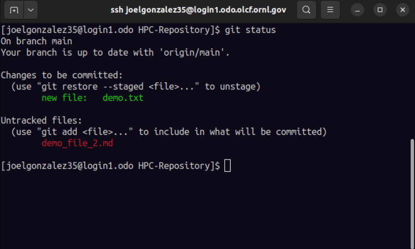
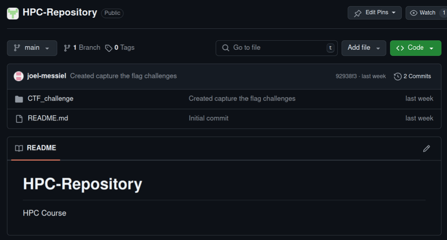
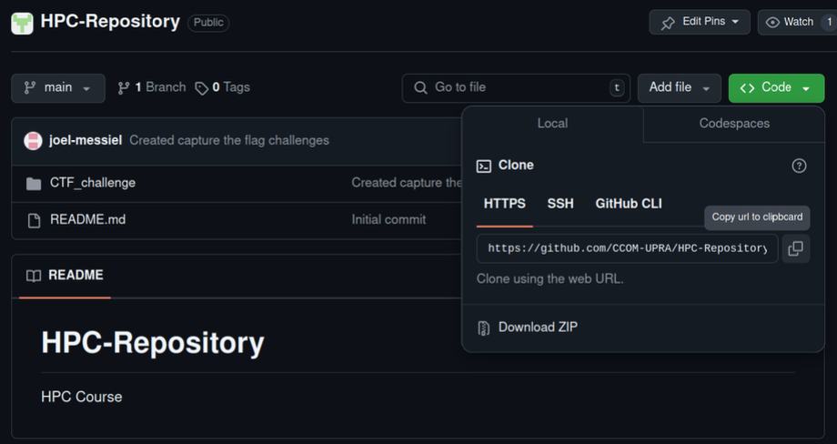

#### Git & GitHub:

###### Basic commands:
- `git init`:
	- creates a local repository in the current directory
- `git status`:
	- displays the current state of the working directory
	- shows file changes
	- 
- `git add <file names>`:
	- sends files to the staging area
	- staging area - a place where files sit waiting to be committed
- `git commit -m "message" <file names>`:
	- Records a snapshot of the current state of the files in the staging area, creating a new commit in the repository
	- commits can be viewed, modified or reverted
- `git log`:
	- displays commit history
	- shows the author, date, message and hash of the commit
	- the hash is important since it is used to reference, inspect or manipulate specific commits
- `git pull`:
	- fetches changes from a remote repository into your local repository branch

###### Clone a repository:
- Head to the repository you want to clone and click the green code button:

- copy the HTTPS address:

- run the following command on your home directory: `git clone https://github.com/CCOM-UPRA/HPC-Repository.git`:

###### Push to a remote repository:
- Get Personal access token from GitHub
	- In the top-right corner click your profile icon
	- Click:
	  - 
	- In the menu bar to your left click:
	  - 
	- In Personal access tokens click Tokens (classic):
	  - 
	- In Generate new token click Generate new token (classic):
	  - 
	- Now add a note and check the repo box:
	  - 
	- Click:
	  - 
	- Copy the token and save it in a text file. Do not share this with anyone.
- `git push`:
	- sends commits from your local repository to its corresponding remote repository
	- when asked for the username enter your GitHub username
	- when asked for the password enter your personal access token